## 如何发现

明明不应该联动，却要被动配合

## 架构常识

- 当调用放需要关心执行结果，通常使用RPC调用。

  如果执行结果和业务强相关，应该在上游业务中处理，而不是放到底层通用服务

- 不关心执行结果，应通过消息通知 MQ 

  例子：帖子发布

  

  ## 参考资料

  https://mp.weixin.qq.com/s/LV7spdfeIWasfy6wVlzGjw